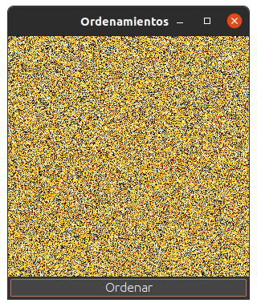

# Visualization Of Sorting Algorithms

* Visualization of the implementation of 4 known sorting algorithms on some images:
    - Selection Sort
    - Insertion Sort
    - Merge Sort
    - Quick Sort

## Running the program from the terminal ⌨️

* First, for compile the program only execute/run in the src folder: 

```
$ javac sort/Main.java
```

* Second, for run the program only execute/run in the src forder: 

```
$ java sort.Main <resource file> <speed> <algorithm>
```

 - Where <resource file> is the name of the image file to process. It must be in the 'resource' folder
 - <speed> is the number of iterations that will occur before doing an update to the graphical interface
 - <algorithm> is the sorting algorithm that we want to see.

 ### Some examples:
    ```
    $ java sort.Main imagen1 30 bubble
    $  java sort.Main imagen2 100 bubble
    $  java sort.Main imagen2 100 selection
    $  java sort.Main imagen3 100 merge
    $  java sort.Main imagen4 100 quick
    ```


## Running the program using make ⌨️

-  To execute the example: Which generates a window with image1, framerate 30 and using bubble sort.

```
make
```

-  to execute with parameters:
    - example: make run p1=imagen2 p2=100 p3=bubble
    - example: make run p1=imagen3 p2=200 p3=merge

```
make run p1=imagen3 p2=framerate p3=algoritmo
```

- Images of the example:

|  |
|:---------------------------:|
| Before ordering |

|  |
|:---------------------------:|
| After ordering |

---
⌨️ con ❤️ por [Jose-MPM](https://github.com/Jose-MPM) 😊🔧
